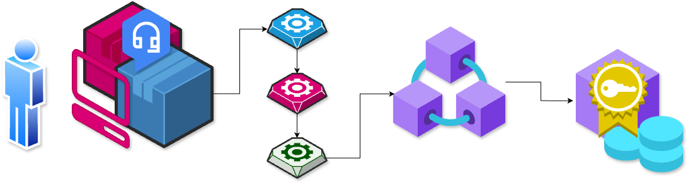
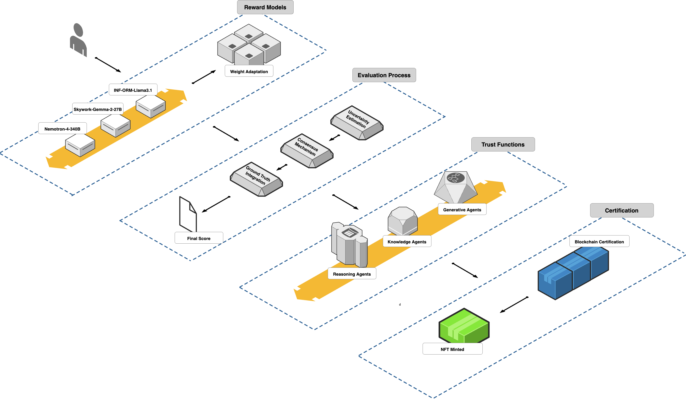
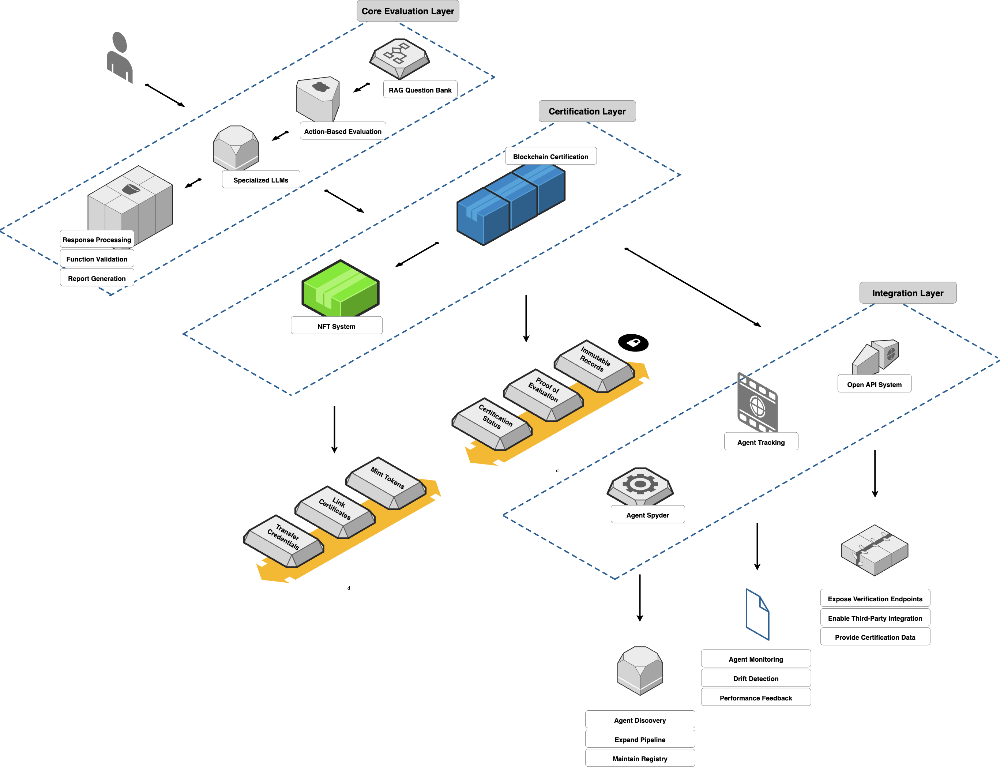

# HyperParams: A Decentralized Framework for AI Agent Assessment and Certification

## Overview

HyperParams is a **decentralized framework** for **assessing and certifying AI agents** using multi-model reward ensembles, text-based and action-based testing, and **NFT-based** on-chain certification. This ensures **transparent, robust, and verifiable** AI evaluations across domains like **finance**, **healthcare**, and **autonomous systems**.

## Table of Contents
- [Overview](#overview)
- [Features](#features)
- [Why HyperParams?](#why-hyperparams)
- [How It Works](#how-it-works)
  - [1. Text-Based Testing](#1-text-based-testing)
  - [2. Multi-Model Reward Ensemble](#2-multi-model-reward-ensemble)
  - [3. Action-Based Testing](#3-action-based-testing)
  - [4. NFT-Based Certification](#4-nft-based-certification)
- [Implementation](#implementation)
- [Limitations & Future Enhancements](#limitations--future-enhancements)
  - [Current Limitations](#current-limitations)
  - [Planned Improvements](#planned-improvements)
- [Use Cases](#use-cases)
- [How to Contribute](#how-to-contribute)
- [License](#license)
- [Contact Information](#contact-information)

---

## Features
- 🎯 **Multi-Model Reward Ensemble** – Aggregates evaluations from multiple large language models (LLMs) to reduce bias  
- 💡 **Text-Based Testing** – Assesses reasoning steps, explanations, and factual correctness  
- ⚙️ **Action-Based Testing** – Evaluates API calls, function executions, and security compliance  
- 🏆 **NFT Certification** – Stores assessment results on-chain for tamper-proof verification  
- 🎛 **Domain-Specific Trust Functions** – Adapts evaluation criteria to different industry requirements  

---

## Why HyperParams?
- 🌐 **Decentralized & Transparent** – Eliminates reliance on centralized AI audits  
- 🤝 **Bias Mitigation** – Reduces over-dependence on single-model assessments  
- 🛡️ **Security & Compliance** – Identifies hidden vulnerabilities in AI decision-making  
- ⚡ **Cross-Domain Adaptability** – Suitable for multiple industries (finance, healthcare, etc.)

---

## How It Works

  *Text-based testing framework with four key stages: (A) Reward Models, (B) Evaluation Process, (C) Trust Functions, and (D) Certification.*

### 1. Text-Based Testing
* Evaluates AI agents' **textual responses** for:
  - Semantic accuracy (cosine similarity to reference answers)
  - Logical consistency
  - Factual correctness (knowledge-base lookups)

### 2. Multi-Model Reward Ensemble
* Employs multiple specialized LLMs (e.g., **Nemotron-4-340B**, **Skywork-Reward-Gemma-2-27B**) to produce a **combined score**, reducing **single-model bias**.

### 3. Action-Based Testing
* Inspects **function calls**, external API usage, and code execution to catch harmful or unauthorized operations.

  *Action-based testing framework with three main layers: (A) Core Evaluation Layer, (B) Certification Layer, and (C) Integration Layer.*

### 4. NFT-Based Certification
* Stores **final scores on-chain** as NFTs:
  - **Immutable**, publicly verifiable records
  - **Third-party integration** for robust real-world validation

---

## Implementation

### Prototype
- Built on **Solana** for **low transaction fees** and **high throughput**  
- Uses **IPFS** for decentralized storage of **detailed logs**  

## Limitations & Future Enhancements

### Current Limitations
- 🚧 Scalability – On-chain updates can be costly at scale; Layer 2 solutions are in progress
- 🔒 Security & Privacy – Requires advanced zk-proof techniques for private yet verifiable logs
- ⚖️ Trust Function Calibration – Needs domain-specific refinements and iterative tuning

### Planned Improvements
- 🏅 Expanded Benchmarks – Covering multi-task QA, code generation, and bias detection
- 🌀 Scalable Tokenomics – Integrating staking and governance mechanics
- 🏗 Advanced Security – Formal verification, Byzantine-resistant consensus, and zero-knowledge proofs

## Use Cases
- 🏥 Healthcare AI – Validates patient safety and compliance with medical data regulations
- 💰 Financial AI – Certifies trading bots or robo-advisors for regulatory adherence
- 📢 Social AI – Ensures chatbots meet standards for harassment prevention and misinformation checks

## Contributing
1. Fork the [repository](https://github.com/AIFlowML/hyperparams)
2. Create your feature branch
3. Run tests and ensure they pass
4. Submit a pull request

## License
This project is licensed under the MIT License - see the LICENSE file for details.

## Contact Information
- Website: [hyperparams.io](https://hyperparams.io/)
- Email: ilessio@hyperparams.io, develop@hyperparams.io
- Whitepaper: [INSERT PAPER]